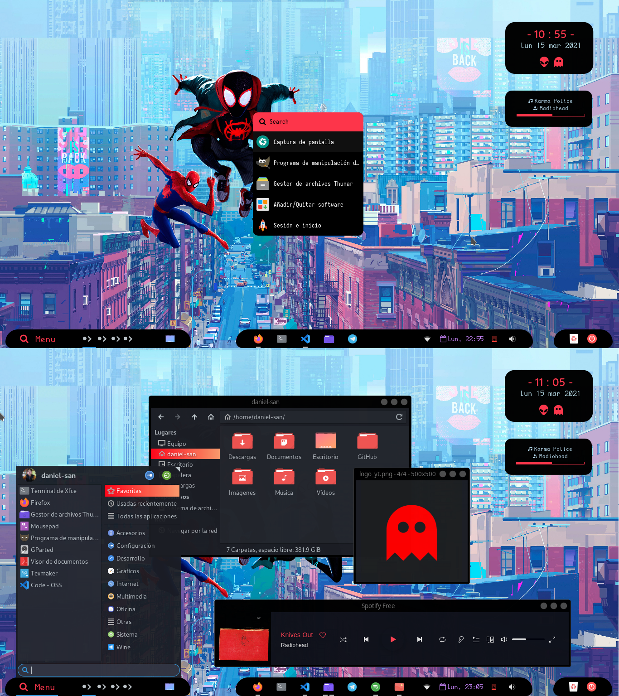

  <h1>Bienvenidos</h1>

**Mi configuración del escritorio Xfce** :heart:

Estos son mis archivos de configuración 

### Algunas cosas que uso

* **Tema**: [Matcha Dark Azul](https://github.com/vinceliuice/Matcha-gtk-theme)
* **Iconos**: [Tela](https://github.com/vinceliuice/Tela-icon-theme)
* **mpd & ncmpcpp**: Para reproducir musica música
* **rofi**
* **Spotify**
* **Conky**: Para crear y agregar Widgets al escritorio
* **Fonts**:[Nerd Fonts](https://www.nerdfonts.com/)
* **Elemtos del Panel**: 
  * [*Docklike*](https://github.com/nsz32/docklike-plugin)
  * **Whisker Menu**: Usando **Pango Markup** y **Nerd Fonts** se puede modificar el titulo del complemento.

    ~~~~
         Menu  
    ~~~~
  * **Reloj**: similar a Whisker Menu

    ~~~~
       %a 
    ~~~~
* **Thunar & Panel & Whisker menu**: Cambio de color o forma gracias al alchivo gtk.css

  * *Aplicar cambios*
    ~~~~
    thunar -q
    ~~~~

    ~~~~
    xfce4-panel -r
    ~~~~

