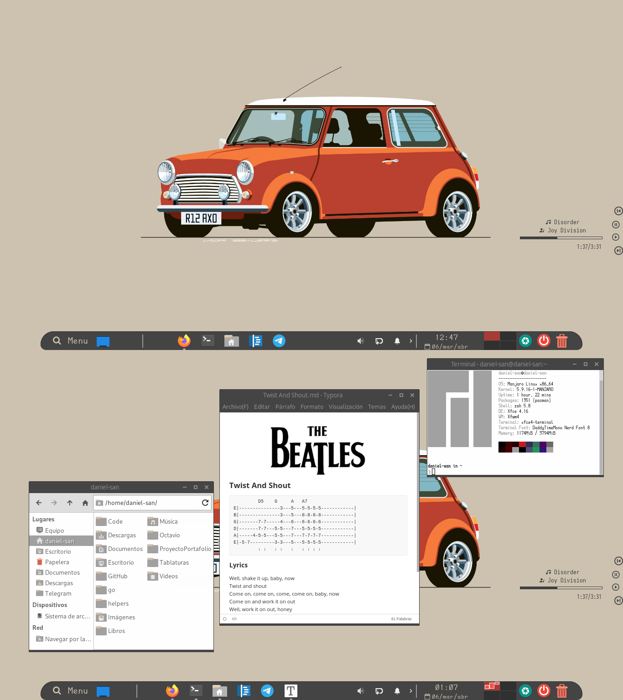

  <h1>Mi Configuración del Escritorio Xfce</h1>

#### Requerimientos

* [Picom-Tryone](https://github.com/tryone144/picom/tree/feature/dual_kawase): el panel puede parpadear cuando se redondea los bordes usando el compositor por defecto, pero picom lo soluciona
* [Fonts](https://www.nerdfonts.com/): Iosevka && DaddyTimeMono 
* Conky, mpd, mpc, ncmpcpp : para mostrar y controlar mi musica
* **complementos del xfce4-panel**
  * [docklike](https://github.com/nsz32/docklike-plugin)
  * [genmon](https://docs.xfce.org/panel-plugins/xfce4-genmon-plugin/start): lo uso para crear unos botones para pausar, saltar y reproducir mi música gracias mpc, se puede usar para mostrar muchas mas cosas, para más ejemplos [aqui](https://github.com/xtonousou/xfce4-genmon-scripts)
* Temas: Los temas que más uso; Numix, Matcha
* Iconos: Los iconos que más uso; Papirus, Surfn, Tela

* **Configurar el  Panel y sus elementos**: La forma, tamaño de iconos, colores, bordes y demas cosas se puede cambiar por medio del achivo  ***~/.config/gtk-3.0/gtk.css*** , no solo el panel, tambiem thunar, whisker y muchas mas cosas, para mas info [aqui](https://docs.xfce.org/xfce/xfce4-panel/theming)

  * **Whisker Menu**: Usando **Pango Markup** y **Nerd Fonts** se puede modificar el titulo del complemento.

  ~~~~
    Menu 
  ~~~~

  * **Reloj**: similar a Whisker Menu

    ~~~~
             %I:%M           %n     %d/%a/%b         
    ~~~~

* **Thunar & Panel & Whisker menu**: Cambio de color o forma gracias al alchivo gtk.css

  * *Aplicar cambios*
    ~~~~
    thunar -q
    ~~~~

    ~~~~
    xfce4-panel -r
    ~~~~

